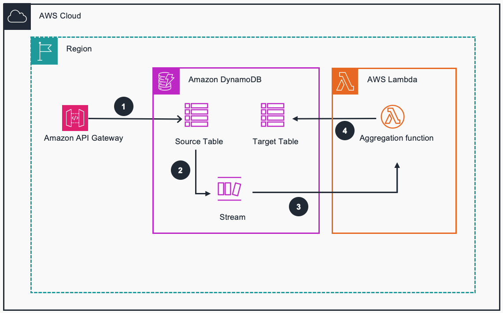

#  Guidance for building aggregations for Dynamodb tables using Amazon Dynamodb streams on AWS

## Table of Content (required)

List the top-level sections of the README template, along with a hyperlink to the specific section.

### Required

1. [Overview](#overview-required)
    - [Cost](#cost)
2. [Prerequisites](#prerequisites-required)
    - [Operating System](#operating-system-required)
3. [Deployment Steps](#deployment-steps-required)
4. [Deployment Validation](#deployment-validation-required)
5. [Running the Guidance](#running-the-guidance-required)
6. [Next Steps](#next-steps-required)
7. [Cleanup](#cleanup-required)

***Optional***

8. [FAQ, known issues, additional considerations, and limitations](#faq-known-issues-additional-considerations-and-limitations-optional)
9. [Revisions](#revisions-optional)
10. [Notices](#notices-optional)
11. [Authors](#authors-optional)

## Overview (required)

This AWS Guidance is built to showcase how to perform aggregations on Amazon DynamoDB tables using Amazon DynamoDB Streams and AWS Lambda. It addresses the challenge of efficiently aggregating data in DynamoDB tables, which is crucial for applications needing to perform operations like counting, summing, or determining max/min values directly on DynamoDB without exporting data to other services or performing costly table scans. This solution leverages the real-time processing capability of DynamoDB Streams coupled with the compute power of AWS Lambda to efficiently aggregate data, offering a method to handle real-time data aggregation needs within DynamoDB itself.

For more detailed information, please visit the AWS Database Blog post​ http://disq.us/t/4j3itk0.

Architecture diagram:



### Cost 

The following table provides a sample cost breakdown for deploying this Guidance with the default parameters in the US East (N. Virginia) Region for one month.

| AWS service  | Dimensions | Monthly Cost [USD] |
| ----------- | ------------ | ------------ |
| Amazon DynamoDB | Average item size 0.5kb, 0.5 RCU and 1 WCU per message  | $ 17.08 month |
| AWS Lambda | 1 Million requests per month without advanced security feature | $ 6.73 month |
| Total |  | $ 23.81 |

We recommend creating a [Budget](https://docs.aws.amazon.com/cost-management/latest/userguide/budgets-managing-costs.html) through [AWS Cost Explorer](https://aws.amazon.com/aws-cost-management/aws-cost-explorer/) to help manage costs. Prices are subject to change. For full details, refer to the pricing webpage for each AWS service used in this Guidance.

## Prerequisites

- The [AWS CLI](https://docs.aws.amazon.com/cli/latest/userguide/getting-started-install.html) installed.
- The visual editor of your choice, for example [Visual Studio Code](https://code.visualstudio.com/).
- Install CloudFormation template to quickly deploy and test the solution. Follow the steps that are mentioned in this [link](https://docs.aws.amazon.com/AWSCloudFormation/latest/UserGuide/cfn-console-create-stack.html) to deploy the stack.
- Permissions to deploy an DynamoDB table and an AWS Lambda function.

## Operating systems

This solution supports build environments in Mac or Windows.

### AWS account requirements (If applicable)
This deployment requires that you have access to the following AWS services:

- Amazon DynamoDB
- AWS Lambda

### Service limits  (if applicable)

<Talk about any critical service limits that affect the regular functioning of the Guidance. If the Guidance requires service limit increase, include the service name, limit name and link to the service quotas page.>

### Supported Regions (if applicable)

<If the Guidance is built for specific AWS Regions, or if the services used in the Guidance do not support all Regions, please specify the Region this Guidance is best suited for>


## Deployment Steps (required)

Deployment steps must be numbered, comprehensive, and usable to customers at any level of AWS expertise. The steps must include the precise commands to run, and describe the action it performs.

* All steps must be numbered.
* If the step requires manual actions from the AWS console, include a screenshot if possible.
* The steps must start with the following command to clone the repo. ```git clone xxxxxxx```
* If applicable, provide instructions to create the Python virtual environment, and installing the packages using ```requirement.txt```.
* If applicable, provide instructions to capture the deployed resource ARN or ID using the CLI command (recommended), or console action.

 
**Example:**

1. Clone the repo using command ``` git clone https://github.com/aws-solutions-library-samples/guidance-for-building-aggregations-for-dynamodb-tables-using-amazon-dynamodb-streams-on-aws.git```
2. cd to the repo folder ```cd guidance-for-building-aggregations-for-dynamodb-tables-using-amazon-dynamodb-streams-on-aws```
3. cd to deployment folder to deploy the cloudformation template ```cd deployment```
4. Run the below command to deploy the stack in your account.
```
aws cloudformation create-stack \
--stack-name ddbaggregate \
--template-body file://CloudFormation.yaml \
--capabilities CAPABILITY_NAMED_IAM
```


## Deployment Validation  (required)

<Provide steps to validate a successful deployment, such as terminal output, verifying that the resource is created, status of the CloudFormation template, etc.>


**Examples:**

* Open CloudFormation console and verify the status of the template with the name starting with xxxxxx.
* If deployment is successful, you should see an active database instance with the name starting with <xxxxx> in        the RDS console.
*  Run the following CLI command to validate the deployment: ```aws cloudformation describe xxxxxxxxxxxxx```


## Running the Guidance (required)

<Provide instructions to run the Guidance with the sample data or input provided, and interpret the output received.> 

This section should include:

* Guidance inputs
* Commands to run
* Expected output (provide screenshot if possible)
* Output description


## Next Steps (required)

Provide suggestions and recommendations about how customers can modify the parameters and the components of the Guidance to further enhance it according to their requirements.


## Cleanup (required)

- Include detailed instructions, commands, and console actions to delete the deployed Guidance.
- If the Guidance requires manual deletion of resources, such as the content of an S3 bucket, please specify.


## FAQ, known issues, additional considerations, and limitations (optional)


**Known issues (optional)**

<If there are common known issues, or errors that can occur during the Guidance deployment, describe the issue and resolution steps here>


**Additional considerations (if applicable)**

<Include considerations the customer must know while using the Guidance, such as anti-patterns, or billing considerations.>

**Examples:**

- “This Guidance creates a public AWS bucket required for the use-case.”
- “This Guidance created an Amazon SageMaker notebook that is billed per hour irrespective of usage.”
- “This Guidance creates unauthenticated public API endpoints.”


Provide a link to the *GitHub issues page* for users to provide feedback.


**Example:** *“For any feedback, questions, or suggestions, please use the issues tab under this repo.”*

## Revisions (optional)

Document all notable changes to this project.

Consider formatting this section based on Keep a Changelog, and adhering to Semantic Versioning.

## Notices (optional)

Include a legal disclaimer

**Example:**
*Customers are responsible for making their own independent assessment of the information in this Guidance. This Guidance: (a) is for informational purposes only, (b) represents AWS current product offerings and practices, which are subject to change without notice, and (c) does not create any commitments or assurances from AWS and its affiliates, suppliers or licensors. AWS products or services are provided “as is” without warranties, representations, or conditions of any kind, whether express or implied. AWS responsibilities and liabilities to its customers are controlled by AWS agreements, and this Guidance is not part of, nor does it modify, any agreement between AWS and its customers.*


## Authors (optional)

Name of code contributors
